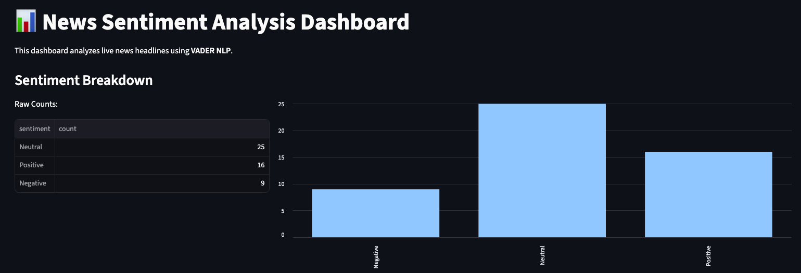

# 📊 AI Sentiment Analysis Sandbox
**A prototype for exploring how AI-driven insights can be visualized and governed in a guided user experience.**



## 🎯 Project Overview
This project is a personal "Zero-to-One" build designed to bridge the gap between raw, unstructured news data and actionable business intelligence. 

As a Product Manager, I built this to explore the challenges of:
* **Data Orchestration:** Automating ingestion of real-time data from the NewsAPI.
* **Sentiment Modeling:** Leveraging VADER for lightweight, rule-based NLP to drive decision-making.
* **Guided UX:** Building a Streamlit interface that translates complex scores into a "Market Vibe" for executive visibility.

## 🛠️ Tech Stack 
* **Ingestion:** Python / NewsAPI
* **NLP Engine:** VADER Sentiment Analysis
* **Product UI:** Streamlit (v1.0 Prototyping)

## 🚀 Key Product Features
* **Automated Pipeline:** Real-time fetching and scoring for immediate sentiment monitoring.
* **Data Integrity & Resilience:** Built-in handling for missing fields, rate-limiting, and error-state messaging.
* **Scalability:** Modular architecture designed to allow for swapping the NLP engine (e.g., to GPT-4) with minimal refactoring.

## 🧠 Model Governance & Tuning
To ensure data integrity and accuracy within a technical news context, I custom-tuned the VADER lexicon to reflect business-specific nuances:
* **Contextual Weighting:** Adjusted weights for terms like "Efficiency" and "OLED" (Positive) vs. "Vulnerability" and "Deepfakes" (Negative).
* **Noise Reduction:** Implemented filters to exclude articles with insufficient metadata to maintain a high-quality "Source of Truth."

## 🛠️ Technical Iteration: Enhancing Context
During initial testing, I identified that headlines alone often lacked the nuance required for accurate sentiment scoring.

* **The Solution:** I refactored the ingestion engine to merge the title and description fields into a single text blob for the NLP engine.
* **The Result:** This increased the model's contextual awareness, significantly reducing misclassifications for complex or nuanced topics.

## 🏗️ System Architecture
1.  **Ingestion Layer:** Connects to NewsAPI to fetch headlines based on specific keyword queries.
2.  **Preprocessing:** Cleans strings and prepares text for inference.
3.  **Inference Layer:** Utilizes a pre-trained Lexicon-based model to assign sentiment polarity scores (-1.0 to +1.0).
4.  **Classification Layer:** Maps polarity scores to categorical labels (Positive, Negative, Neutral) for standardized business reporting.

## 📖 Data Dictionary (Output Schema)
The system produces a refined `news_sentiment_report.csv` designed for downstream analytics:

| Column | Description | Data Type |
| :--- | :--- | :--- |
| **Title** | The headline of the news article. | String |
| **Description** |	A summary blurb used to provide expanded context for NLP analysis. | String |
| **Publisher** | The news outlet source (e.g., BBC, CNBC). | String |
| **Sentiment** | Categorical label (Positive/Negative/Neutral). | String |
| **Score** | Numerical polarity value ($$-1.0$$to$$1.0$$). | Float |
| **Link** | Direct URL to the source, rendered as a clickable link in the UI. | URL |

## 🛡️ Strategic Challenges Overcome
* **Security & Compliance:** Implemented secure credential management using `.env` files to ensure sensitive API keys remain outside of version control.
* **Operational Resilience:** Developed robust error handling for API status codes ($$401$$Unauthorized,$$429$$ Rate Limiting) to ensure platform uptime.
* **Environment Optimization:** Managed complex POSIX file paths and macOS-specific environment configurations for a seamless dev-to-prod transition.

## 🔮 Future Roadmap
* **Time-Series Analytics:** Visualizing sentiment shifts over a 30-day rolling window.
* **Entity Extraction:** Identifying key players (Companies/PE Firms) mentioned within sentiment spikes.
* **Role-Based Access:** Simulating a "Manager Toolkit" view vs. an "Executive Summary" view.

## 💻 How to Run (Step-by-Step)
> **Note for Windows Users:** The commands below use `python3` and `pip3` (macOS/Linux standard). If you are on Windows, simply use `python` and `pip` instead.
### 1. Setup the Project
* **Clone the repo:** Click the green **Code** button at the top of this page, copy the URL, and run this in your terminal:
  ```bash
  git clone https://github.com/dbkalanit-dev/newsapi-sentiment-pipeline.git 
  cd newsapi-sentiment-pipeline
  ```
* **Install the "Brains":** Copy and paste this into the terminal and hit Enter: ```pip3 install -r requirements.txt```
### 2. Configure Your API Key
* Create a new file in your project folder named `.env`.
* Inside that file, paste your key like this: `NEWS_API_KEY=your_actual_key_here`.
### 3. Generate the Data (The Backend)
* Run the ingestion script to fetch and analyze  up to 100 headlines: ```python3 live_ingest.py```
* Wait for the terminal to say: `Done! Report saved as news_sentiment_report.csv`.
### 4. Launch the Dashboard (The Frontend)
* To see the visual report in your browser, run this command: ```python3 -m streamlit run dashboard.py```
* **Note:** Your browser should open automatically. If it doesn't, click the URL shown in the terminal.
