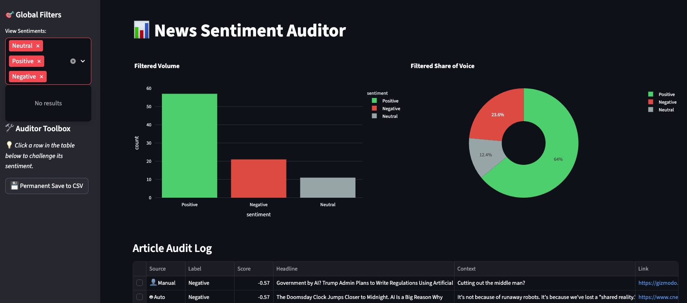

# 📊 AI Sentiment Analysis & Governance Sandbox
**A Human-in-the-Loop (HITL) platform for visualizing, auditing, and overriding AI-driven sentiment insights.**



## 🎯 Project Overview
This project is a "Zero-to-One" build designed to bridge the gap between automated NLP and human domain expertise. It moves beyond simple data visualization to provide a **governance layer**, allowing users to challenge and override model predictions in real-time.

As a Product Manager, I built this to explore:
* **Human-in-the-Loop (HITL) Workflows:** Enabling expert intervention to refine model accuracy.
* **Data Governance:** Implementing a "Source" audit trail to distinguish between AI-generated and human-verified data.
* **Advanced Streamlit UX:** Utilizing session state and event-selection to create a professional auditing interface.

## 🛠️ Tech Stack 
* **Ingestion:** Python / NewsAPI
* **NLP Engine:** VADER Sentiment Analysis (Lexicon-based)
* **Product UI:** Streamlit (v2.0 Auditing Interface)
* **Visuals:** Plotly Express (Interactive charting)

## 🚀 Key Product Features
* **Interactive Auditing Toolbox:** Click any row in the article log to load it into a sidebar "Challenge" module.
* **Granular Sentiment Tuning:** Adjust scores via a precision slider (-1.0 to 1.0) with built-in legend guidance.
* **Visual Audit Trail:** A dedicated `Status` column identifies data as `🤖 Auto` or `👤 Manual`.
* **Stateful Filtering:** Real-time sidebar filters update both the interactive Plotly charts and the data table simultaneously.
* **Persistent Storage:** A manual "Save to CSV" feature allows human overrides to be committed to the master dataset.

## 🏗️ System Architecture
1.  **Ingestion Layer:** Connects to NewsAPI; merges title and description fields for high-context analysis. **Note:** Unlike previous versions that used an "overwrite" model, this layer now utilizes **Append Mode** to build a persistent historical database.
2.  **Inference Layer:** Assigns initial polarity scores using custom-tuned VADER weights.
3.  **Governance Layer (New):** Manages a **Session State** buffer where human overrides are captured and visually flagged.
4.  **UI Layer:** Renders a high-density table with pixel-perfect column weighting and text-wrapping for maximum readability.

## 📖 Data Dictionary (Updated Schema)
| Column | Description | Data Type |
| :--- | :--- | :--- |
| **Status** | Indicates if the record is AI-generated (🤖) or Human-verified (👤). | String |
| **date_published** | Original publication timestamp from the news source (UTC). | ISO-8601 |
| **date_added** | Internal timestamp of when the record entered our database. | DateTime |
| **Sentiment** | Categorical label (Positive/Negative/Neutral). | String |
| **Score** | Numerical polarity value (-1.0 to 1.0). | Float |
| **Title** | The headline of the news article (Text-wrapped). | String |
| **Description** | Expanded context blurb (Text-wrapped). | String |
| **Link** | Clickable URL to the source. | URL |

## 🛡️ Strategic Challenges Overcome
* **UX Information Density:** Solved "horizontal scroll fatigue" by implementing pixel-perfect column constraints and text-wrapping for long-form content.
* **State Persistence:** Managed Streamlit’s "rerun" behavior using `st.session_state` to ensure manual edits aren't lost during filtering or navigation.
* **Visual Encoding:** Standardized color mapping across Bar and Donut charts to reduce cognitive load for executive stakeholders.
* **Data Quality & Deduplication:** Implemented a `sort_values` and `drop_duplicates` logic to ensure the dashboard remains clean even as the underlying CSV grows into a massive historical record.

## 💻 How to Run (Step-by-Step)
> **Note for Windows Users:** The commands below use `python3` and `pip3` (macOS/Linux standard). If you are on Windows, simply use `python` and `pip` instead.
### 1. Setup the Project
* **Clone the repo:** Click the green **Code** button at the top of this page, copy the URL, and run this in your terminal:
  ```bash
  git clone https://github.com/dbkalanit-dev/newsapi-sentiment-pipeline.git 
  cd newsapi-sentiment-pipeline
  ```
* **Install the "Brains":** Copy and paste this into the terminal and hit Enter: ```pip3 install -r requirements.txt```
### 2. Configure Your API Key
* Create a new file in your project folder named `.env`.
* Inside that file, paste your key like this: `NEWS_API_KEY=your_actual_key_here`.
### 3. Generate the Data (The Backend)
* Run the ingestion script to fetch and analyze  up to 100 headlines: ```python3 live_ingest.py```
* Wait for the terminal to say: `Done! Report saved as news_sentiment_report.csv`.
### 4. Launch the Dashboard (The Frontend)
* To see the visual report in your browser, run this command: ```python3 -m streamlit run dashboard.py```
* **Note:** Your browser should open automatically. If it doesn't, click the URL shown in the terminal.
