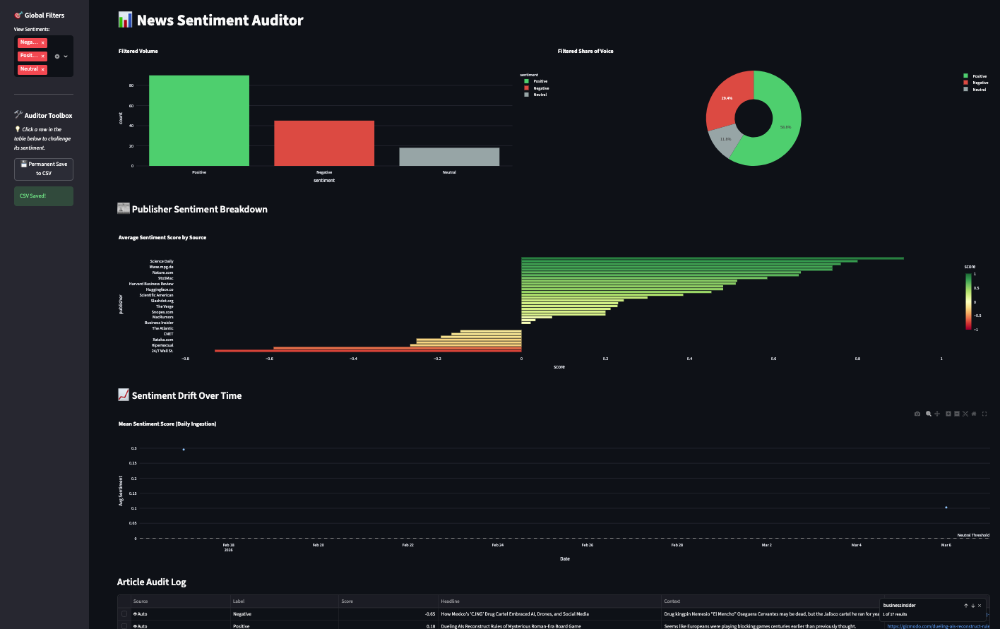

# 📊 AI Sentiment Analysis & Governance Sandbox
**An end-to-end data pipeline that transforms raw unstructured data into actionable business intelligence with a focus on Human-in-the-Loop (HITL) Governance.**



## 🎯 Project Overview
This project bridges the gap between automated NLP scoring and human domain expertise. By implementing a stateful "Auditor Toolbox," this tool enables users to validate, challenge, and override AI-generated sentiment, turning the dashboard into a continuous learning loop for the underlying model.

As a Product Manager, I built this to explore:
* **Global Observability:** Unified filtering across all charts and audit logs using sentiment, date range, and keyword search.
* **HITL Governance:** Built-in override capability allows domain experts to adjust AI scores, with clear "Auto" vs. "Manual" status labeling for full traceability.
* **Cognitive UX:** Standardized color mapping and optimized information density to support faster executive decision-making.
* **Data Integrity:** Robust handling of ISO8601 timestamps and multi-layered filtering to ensure "Source of Truth" reliability.

For a detailed history of updates and improvements, see the [CHANGELOG.md](CHANGELOG.md).

## 🏗️ Tech Stack 
* **Framework:** Streamlit (Session State management)
* **Data Handling:** Pandas (Time-series manipulation & filtering)
* **Visualization:** Plotly (Interactive charts & categorical mapping)
* **API Ingestion:** NewsAPI with VADER sentiment analysis

## 🚀 Key Product Features
* **Interactive Auditing Toolbox:** Click any row in the article log to load it into a sidebar "Challenge" module for real-time overrides.
* **Longitudinal Trend Tracking:** Visualizes "Sentiment Drift" over time using daily resampling to identify macro-level market shifts.
* **Publisher Bias Analysis:** Categorical breakdown of average sentiment scores by news source to identify reporting patterns and model outliers.
* **Global Observability:** Unified filtering (Sentiment, Date Range, and Keyword Search) that updates the entire dashboard state in real-time, providing an investigative lens into the data.
* **Persistent Storage:** A "Save to CSV" feature allows human overrides to be committed to the master historical dataset.

## 🏗️ System Architecture
1.  **Ingestion Layer:** Connects to NewsAPI; merges title and description fields for high-context analysis. 
**Note:** Uses an **Append Mode** to build a persistent historical database.
2.  **Inference Layer:** Assigns initial polarity scores using custom-tuned VADER weights.
3.  **Governance Layer:** Manages a **Session State** buffer where human overrides are captured and visually flagged.
4.  **UI Layer:** Renders high-density tables and interactive Plotly visuals with standardized visual encoding for executive visibility.

## 📖 Data Dictionary (Updated Schema)
| Column | Description | Data Type |
| :--- | :--- | :--- |
| **Status** | Indicates if the record is AI-generated (🤖) or Human-verified (👤). | String |
| **date_published** | Original publication timestamp from the news source (UTC). | ISO-8601 |
| **date_added** | Internal timestamp of when the record entered our database. | ISO-8601 |
| **Title** | The headline of the news article (Text-wrapped). | String |
| **Description** | Expanded context blurb (Text-wrapped). | String |
| **Publisher** | The news outlet source for the article. | String | 
| **Link** | Clickable URL to the source. | URL |
| **Sentiment** | Categorical label (Positive/Negative/Neutral). | String |
| **Score** | Numerical polarity value (-1.0 to 1.0). | Float |

## 🛡️ Strategic Challenges Overcome
* **UX Information Density:** Solved "horizontal scroll fatigue" by implementing optimized column rendering for long-form content.
* **State Persistence:** Managed Streamlit’s "rerun" behavior using `st.session_state` to ensure manual edits aren't lost during filtering or navigation.
* **Empty-State UX:** Integrated "PM Notes" to guide users during initial data collection phases when trend data is insufficient for plotting.
* **Data Quality & Deduplication:** Implemented a `sort_values` and `drop_duplicates` logic to ensure the dashboard remains clean even as the underlying CSV grows into a massive historical record.

## 💻 How to Run (Step-by-Step)
> **Note for Windows Users:** The commands below use `python3` and `pip3` (macOS/Linux standard). If you are on Windows, simply use `python` and `pip` instead.

### ⚠️ Step 0: Clear Old Data (If upgrading)
If you are upgrading from a version older than v3.0, delete your existing `news_sentiment_report.csv`. The new schema adds three columns required for trend analysis.

### 1. Setup the Project
* **Clone the repo:** 
  ```bash
  git clone https://github.com/dbkalanit-dev/newsapi-sentiment-pipeline.git 
  cd newsapi-sentiment-pipeline
  ```
* **Install Requirements:** Copy and paste this into the terminal and hit Enter: ```pip3 install -r requirements.txt```
### 2. Configure Your API Key
* Create a new file in your project folder named `.env`.
* Make sure you have a valid NewsAPI key.
* Inside that file, paste your key like this: `NEWS_API_KEY=your_actual_key_here`.
### 3. Generate the Data (The Backend)
* Run the ingestion script to build your historical record: ```python3 live_ingest.py```
### 4. Launch the Dashboard (The Frontend)
* To see the visual report in your browser, run this command: ```python3 -m streamlit run dashboard.py```
* **Note:** Your browser should open automatically. If it doesn't, click the URL shown in the terminal.
